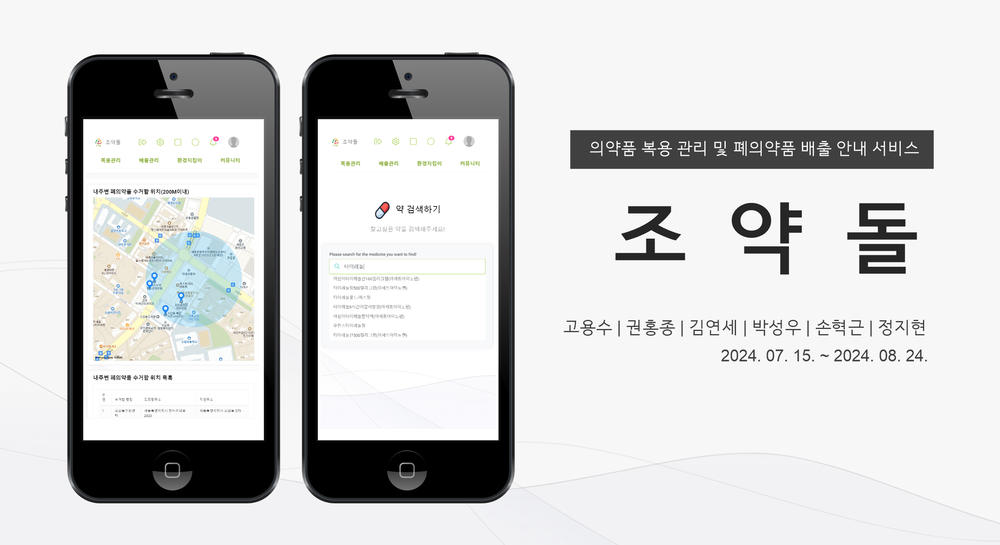

# 💊 의약품 복용 관리/의약품 배출 방법 안내 홈페이지 조약돌
<br>
가정에서 무분별하게 배출한 폐의약품은 토양과 하천을 오염시키고, 언젠가는 우리의 몸 속에 독이 되어 돌아옵니다.
<br>
조약돌 서비스는 가정에서 발생하는 폐의약품을 안전하고 올바르게 배출할 수 있도록 도와주어<br> 
환경오염을 예방하고 국민 건강 증진에 기여하고자 합니다. <br> <br>




<br>

## 프로젝트 소개
- 조약돌은 개인의 체계적인 의약품 복용 관리와 올바른 폐의약품 배출를 도와주는 홈페이지입니다.
- 개인이 복용하는 약을 등록하면 복용 알림 기능을 통해 복용 시간을 알려줍니다.
- 폐의약품이 발생했을 경우 의약품 유형별 올바른 배출 방법을 확인할 수 있습니다.
- 폐의약품 배출이 필요할 경우 나의 거주지를 고려하여 내 주변 수거함 위치를 확인할 수 있습니다.
- 복용등록, 폐의약품 수거함 위치 확인 등 다양한 미션을 통해 환경지킴이 점수를 획득할 수 있습니다.
- 커뮤니티를 통해 사용자간 소통 및 의약품 관련 정보 공유가 가능합니다.

<br>

## 팀원 구성

<div align="center">

| **고용수** | **권홍종** | **김연세** | **정지현** | **박성우** | **손혁근** |
| :------: |  :------: | :------: | :------: | :------: | :------: | 
| 팀장 | 서버 | 개발 | 개발 | 개발 | 개발 |

</div>

<br>

## 1. 개발 환경

- Front : Thymeleaf, JavaScript, HTML, CSS, Bootstrap
- Back-end : Spring Boot
- DataBase : MariaDB
- Library : jQuery
- 버전 및 이슈관리 : Github, Github Project
- 협업 툴 : Github
- 서비스 배포 환경 : Tomcat


<br>

## 2. 프로젝트 구조
```
└── 📁src
    └── 📁main
        └── 📁java
            └── 📁com
                └── 📁omid
                    └── 📁osw
                        └── 📁auth
                        └── 📁common
                            └── 📁exception
                            └── 📁security
                            └── 📁utils
                        └── 📁system
                            └── 📁code
                            └── 📁main
                            └── 📁role
                            └── 📁user
                        └── 📁web
                            └── 📁alarm
                            └── 📁barcode
                            └── 📁community
                            └── 📁envirScore
                            └── 📁mbox
                            └── 📁mypage
                            └── 📁searching
                            └── 📁taking
        └── 📁resources
            └── 📁lib
            └── 📁mapper
                └── 📁alarm
                └── 📁cmmn
                └── 📁envir_score
                └── 📁security
                └── 📁system
                └── 📁taking
            └── 📁static
                └── 📁common
                    └── 📁js
                └── 📁css
                    └── 📁formplugins
                    └── 📁miscellaneous
                        └── 📁filemanager
                        └── 📁fullcalendar                          
                        └── 📁jqvmap
                        └── 📁lightgallery
                        └── 📁nestable
                        └── 📁reactions
                        └── 📁treeview
                    └── 📁notifications
                        └── 📁sweetalert2
                        └── 📁toastr
                    └── 📁page
                    └── 📁skins                 
                    └── 📁themes                      
                └── 📁images
                    └── 📁attendance
                    └── 📁file
                    └── 📁login
                    └── 📁main
                    └── 📁member
                    └── 📁popup
                └── 📁js
                    └── 📁datagrid
                    └── 📁dependency           
                    └── 📁formplugins
                    └── 📁miscellaneous                    
                    └── 📁statistics                                    
                └── 📁webfonts
            └── 📁templates               
                └── 📁auth
                └── 📁file
                └── 📁fragments
                    └── 📁admin                       
                    └── 📁user
                └── 📁layouts
                └── 📁system
                    └── 📁code
                    └── 📁role
                    └── 📁user
                    └── main.html
                └── 📁ui                
                └── 📁web
                    └── 📁barcode
                    └── 📁community
                    └── 📁envir_score
                    └── 📁mbox
                    └── 📁mypage
                    └── 📁searching
                    └── 📁taking

   ```

<br>

## 3. 사용 기술 및 버전

<br>

| Category  | Details ............................................... |
|-----------|--------------------------------------------------------|
| Language  | Java: OpenJDK 17 <br> HTML5 <br> CSS3 <br> JavaScript  |
| Database  | MariaDB                                     |
| Framework | Spring Boot: 3.3.0 <br> MyBatis <br> Thymeleaf |
| System    | Windows: 10 Pro                                        |
| Tool      | GitHub <br> Git Bash <br> MySQL Workbench: 8.0 <br>|
| Server    | Tomcat: Provided by Spring Boot <br> AWS               |
| Libraries | Gson: 2.10.1 <br> Jackson Databind: 2.16.1 <br> Jackson JSR310: 2.16.1 <br> Jackson XML: 2.16.1 <br> Log4j2 <br> Google Cloud Vision: 3.34.0 <br> Springdoc OpenAPI UI: 1.6.14 <br> Apache Commons Exec: 1.3 <br> Apache HttpClient 5: 5.2.1 |

## 4. 역할 분담

### 🍊고용수(프로젝트 총괄)

- **기능**
    - 복용약 검색, 복용메인, 복용약 등록
- **기타**
    - 의약품 조회 API 연동
    - 이미지 -> 텍스트 추출을 위한 Google Cloud Vision API 연동 (서비스 준비중)
    - Chat GPT 연동 (서비스 준비중)
    - 공통 추가 작업

<br>
    
### 👻권홍종

- **기타**
    - CI/CD(지속적 통합 및 지속적 배포)
    - Oracle Cloud를 통한 서버 구축

<br>

### 😎김연세

- **기능**
    - 복용 스케줄 구현
    - 알림 기능 구현
    - 마이페이지 구현
- **기타**
    - 세부 페이지 UI/UX 구성

<br>

### 🐬박성우

- **기능**
    - UI/UX
    - 컴포넌트별 모듈화
    - 시스템 관리
- **기타**
    - 유저 엔티티 및 공통 설계
    - Front 공통 구현
    
<br>

### 🐬손혁근

- **기능**
    - 폐의약품 배출방법 안내, 폐의약품 수거함 위치 정보 제공
    - 커뮤니티 및 공지사항 게시판 구현
- **기타**
    - Spring Boot 설정 및 Github 프로젝트 세팅
    - KAKAO Map API 연동
    - 세부 페이지 UI/UX 구성
    - Backend 공통 구현
    
<br>

### 🐬정지현

- **기능**
    - 환경지킴이 점수 등록 / 조회 / 분석
- **기타**
    - 제출 구비 문서 및 프로젝트 가이드 작성 
    - 아키텍처 구성도 작성
    
<br>

## 5. 개발 기간 및 작업 관리

### 개발 기간

- 전체 개발 기간 : 2024-07-15 ~ 2024-08-24
- UI 구현 : 2024-07-15 ~ 2024-07-27
- 기능 구현 : 2024-07-28 ~ 2024-08-24

<br>

### 작업 관리

- GitHub Projects와 Issues를 사용하여 진행 상황을 공유했습니다.
- 매주 토요일 주간회의를 진행하며, 개발성과를 공유하고, 개발 진척도 및 향후 계획을 논의 했습니다.

<br>


## 7. 페이지별 기능

### [로그인]
- 아이디와 비밀번호를 입력하면 입력창에서 바로 유효성 검사가 진행되고 통과하지 못한 경우 로그인에 실패합니다.
- 로그인에 성공하면 홈 화면으로 이동합니다.

### [로그아웃]
- 상단의 나가기 아이콘을 클릭하면 로그아웃이 되고, 홈 화면에서 초기 로그인화면으로 이동합니다.


### [홈 메인페이지]
- 상단 아이콘을 클릭하여 원하는 페이지로 이동합니다.
    - 로그아웃 아이콘 : 브라우저 상에 기록된 이전 페이지로 돌아갑니다.
    - 시스템 관리 아이콘(관리자 로그인) : 사용자 검색 페이지로 이동합니다.
    - 프로필 아이콘 : 채팅룸 페이지의 경우 상대방의 사용자 이름을 보여줍니다.
    - 화면(O) 아이콘 : 화면 모드를 다크모드, 라이트모드로 변경합니다.
- 하단 카테고리 탭을 클릭하여 원하는 페이지로 이동합니다.
    - 복용관리 : 복용약검색, 복용메인, 복용약 등록, 복용스케줄로 이동합니다.
    - 배출관리 : 폐의약품 배출방법, 내 주변 폐의약품 수거함, 폐의약품 수거함 검색으로 이동합니다.
    - 환경지킴이 : 환경지킴이 점수 조회, 나의 활동 분석, 포인트 쌓기로 이동합니다.
    - 커뮤니티 : 커뮤니티로 이동합니다.

<br>

### [시스템관리]
- 관리자 권한이 존재하는 계정으로 로그인한 후,
  홈 화면 우측 상단의 시스템관리 아이콘을 클릭하면 시스템 관리 - 사용자 관리 페이지로 이동합니다.
- 사용자 관리 페이지에서는 해당 시스템의 전체 사용자 목록을 조회할 수 있으며
  그리드 옵션을 통해 검색 필터링 혹은 정렬 필터링 기능을 사용할 수 있습니다.
- 좌측 내비게이션의 권한 관리 메뉴를 클릭하면 아코디언을 통해 하위 메뉴인 역할 관리, 사용자 역할 매핑
  메뉴가 나타납니다.
- 역할 관리 페이지에서는 시스템에서 사용하고자하는 역할을 조회하고 관리할 수 있으며
  그리드의 편집 기능을 통해 역할에 대한 신규 추가 및 수정 삭제 등 다 건의 데이터 편집을 일괄적으로
  처리할 수 있습니다.  
- 사용자 역할 매핑 페이지의 좌측에는 활성화 상태에 놓여져있는 역할 목록이 나타나며,
  우측에는 선택된 역할이 부여된 사용자 목록을 확인할 수 있습니다.
  또한, 사용자 매핑 목록 데이터테이블의 편집 기능과 사용자 추가 모달을 통해 각 역할별로 사용자들을
  매핑 등록 및 해제할 수 있습니다.
- 위와 같은 기능을 통해 해당 시스템은 사용자를 관리하고 다양한 역할을 구비하여
  사용자에게 부여함으로써 목적에 맞는 관리 계획을 수립할 수 있습니다.   

### [마이페이지]
- 로그인 후 홈 화면 상단의 프로필 아이콘을 클릭하면 사용자 관련 메뉴가 드롭박스를 통해 나타납니다.
- 드롭박스를 통해 나타난 하위 메뉴 중 마이페이지를 선택하여 이동합니다.
- 마이페이지에서는 최근 복용 내역, 나의 환경지킴이 점수, 최근 로그인 기록 등을 조회할 수 있습니다.
- 비밀번호 변경, 탈퇴하기 버튼을 클릭하면 해당 기능을 수행하기위한 페이지로 이동합니다.
- 고객지원 탭에서 문의하기/공지사항 보기 버튼을 클릭하면 해당 기능을 수행하기위한 페이지로 이동합니다.
- 프로필 사진은 직접 등록한 이미지가 존재하지않을 경우 기본 이미지로 대체합니다.

<br>

### [복용관리]

#### 1. 복용약 검색
- 찾고 싶은 약의 이름을 일부 작성하면 실시간으로 해당 키워드가 포함되는 의약품 데이터가
  자동완성창에 나타납니다.
- 키워드를 통해 검색한 의약품을 선택하면 상세 조회 페이지로 이동하며,
  효능, 사용법, 주의사항, 부작용, 보관법, 상호작용, 이미지 등의 상세 정보가 나타납니다.

<br>

#### 2. 복용메인
- 현재 복용중인 약의 정보가 나타납니다.
- 최근 복용했던 의약품 이력이 나타납니다.

<br>

#### 3. 복용약등록
- 복용약 등록 페이지로 이동하게되면, 1개 등록 양식이 준비되어있습니다.
- 등록하기 위 + 버튼을 클릭하여 등록하고자 하는 다 건의 양식을 추가할 수 있습니다.
- 각 양식별로 약품명 검색을 통해 등록하고자 하는 의약품의 이름을 일부 작성하면,
  실시간으로 해당 키워드가 포함되는 의약품 데이터가 자동완성창에 나타납니다.
- 키워드를 통해 검색한 의약품을 선택하면 해당 양식에 선택한 의약품이 등록됩니다.
- 의약품 선택 이후 복용시작일, 총투약일, 함량, 1회투약량, 1일투약횟수, 메모하기 등의
  상세 내용을 함께 기재한 후 등록하기 버튼을 클릭합니다.
- 등록 이전에 각 양식별로 유효성 검증이 일어나며, 해당 검증을 통과하지 못할 경우
  양식의 입력란마다 안내 메시지가 표출됩니다. 
  모든 입력란에 대한 유효성 검증을 통과할 경우 복용약 등록 정보를 저장합니다.

<br>

#### 4. 복용스케줄(알람)
- 등록한 의약품에 대해 알람이 설정됩니다.
- 로그인할 때 팝업창을 통해 알람 내용이 나타납니다.

<br>

### [폐의약품 배출]

#### 1. 폐의약품 배출방법
- 폐의약품 분리배출의 필요성을 안내합니다.
- 의약품 종류별 배출방법을 안내합니다.

<br>

#### 2. 내 주변 폐의약품 수거함
- KAKAO Map API를 사용하여 거주지를 기반으로 내 주변 폐의약품 수거함 위치를 지도에 표시합니다.
- 지도 하단의 표를 통해 수거함 세부 정보(명칭, 도로명 주소, 지번주소)를 안내합니다.

<br>

### [환경지킴이 점수]

#### 1. 나의 환경지킴이 점수 등록
- 나의 주변 수거함 확인, 복용 등록 등 폐의약품 배출 활동 시 환경지킴이 점수가 5점씩 등록됩니다.
- 커뮤니티 게시글을 등록할 때 환경지킴이 점수가 2점씩 등록됩니다. 

<br>

#### 2. 나의 환경지킴이 점수 조회
- 나의 환경지킴이 세부 점수를 표시합니다.
  
<br>

#### 3. 환경지킴이 점수 분석
- 전체 사용자 평균 점수와 나의 평균 점수를 비교하여 표시합니다.

<br>

### [커뮤니티] 

- 개발중
  
<br>

## 10. 개선 목표

- 회원가입 개선
- 소셜 로그인 개선
- 커뮤니티 개선
- 처방전 개선
- 관리자 기능 개선
- 서버 보완
- 모바일 기능 보완

<br>

## 11. 공공데이터포털 API
### [사용내역]

- 식품의약품안전처_의약품개요정보(e약은요)
- 식품의약품안전처_의약품개요정보(e약은요)
- 세종특별자치시_폐의약품 수거함 현황
- 식품의약품안전처_의약품안전사용서비스(DUR)품목정보
  
### [사용목적]
- 의약품 검색 및 폐의약품 수거함 위치 정보 확인을 위해 사용

<br>


